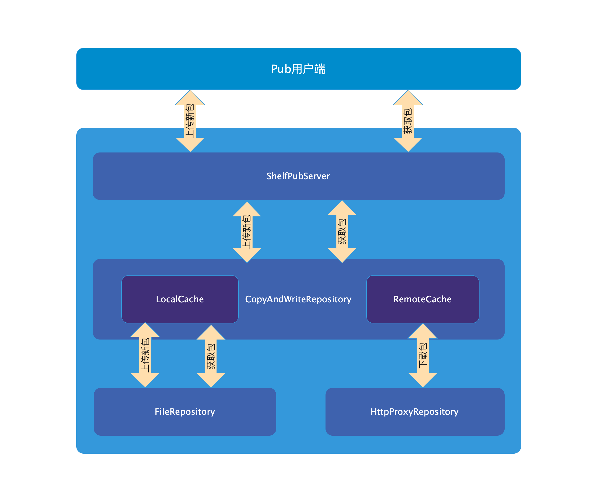

# 架构分析

## pub_server架构图

## 代码架构

### ShelfPubServer

该类是基于`Shelf`框架实现的服务端框架。`ShelfPubServer`持有了一个存储库对象`PackageRepository repository`，持有了一个缓存对象`PackageCache cache`。

`requestHandler`方法是`Shelf`框架的响应方法，用来解析响应不同的请求API。如果需要新增API，可以在该方法中添加响应代码。

### PackageRepository

定义包存储库的抽象类，定义了`versions()`，`upload()`，`download()`等方法。

### FileRepository

`PackageRepository`的子类，以文件存储的方式实现了包的上传和下载。

### HttpProxyRepository

`PackageRepository`的子类，只实现了包的下载，从`https://pub.flutter-io.cn`网址下载对应的包。

### CopyAndWriteRepository

`PackageRepository`的子类，它分别持有了`FileRepository`和`HttpProxyRepository`的实例，而且持有了他们对应的`_RemoteMetadataCache`缓存实例，当查询包的时候，会优先从缓存中查询。
